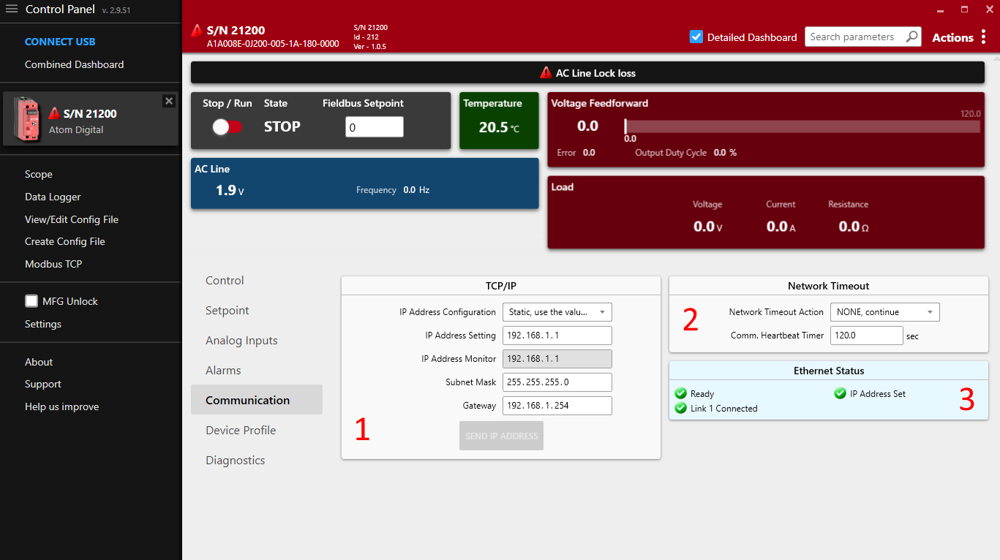

# Overview

:::note
Control Concepts has run the [EtherCat Conformance Test Tool](https://www.ethercat.org/en/products/2B8481D0918740AE91AF0AECE1FF8C2F.htm) to verify that ATOM is fully compliant with the EtherCAT standard.
:::

## ESI file
:::info
Download ATOM's ESI file: [Atom.xml](./assets/Atom.xml).
:::

## Control Panel Communication Settings

Some communication settings can be configured in the **Communication** tab in [Control Panel](/control-panel/overview).

- Section `1`: TCP/IP settings
  - **IP Address Configuration**
    - `Static`: Use the IP address, subnet mask, and gateway specified below.
    - `DHCP`: Use DHCP to obtain an IP address.
  - **IP Address Setting**: The IP address of the ATOM controller.
  - **IP Address Monitor**: The current IP address of the ATOM controller.
  - **Subnet Mask**: The subnet mask of the ATOM controller.
  - **Gateway**: The gateway address for the ATOM controller.
- Section `2`: Network Timeout
  - The EtherNet/IP heartbeat timeout (Encapsulation Inactivity Timeout) in seconds.
  - You can configure a network timeout action to perform when the device loses communication with the PLC:
    - `None`: Do nothing
    - `STOP, fault shutdown`: STOP the controller, disabling output
    - `Use network timeout setpoint`: Configure an alternative setpoint to use when the controller loses communication with the PLC.
- Section `3`: Ethernet status
  - Indicates the status of both RJ45 ports, IP address configuration, conflict detection, and any other errors with the EtherNet/IP connection.

:::info
## Control Panel and PLC software

These settings are synchronized with your PLC environment. You do not have to use Control Panel to change these settings - you can stay in your PLC software.
Control Panel merely provides them as an altnerative way to configure ATOM's EtherNet/IP settings.

You can use Control Panel simultaneously with your PLC software without issues.
:::

:::warning
## IP Address Conflict Detection

ATOM uses **IP Address Conflict Detection** to detect IP address conflicts on the network. If ATOM detects another device using the same IP address, it will disable all network communication until the conflict is resolved.

Please ensure all devices on the network are assigned unique a IP address.
:::

## Hardware considerations

:::warning
## Daisy chaining

As ATOM has two RJ45 ports, it can be easily daisy-chained. When daisy-chaining ATOM, take care to avoid a loop in the network. In some loop configurations, ATOM is susceptible to
network broadcast storms, which can cause the controller to become unresponsive. If you are daisy-chaining ATOM, ensure that the network is loop-free.

ATOM works with both unmanaged and managed switches. We recommend a managed switch for larger networks to give you more control over the network topology.
:::

## Parameters

### Overview

The following is an overview of the parameters available over EtherCAT. These parameters can be accessed and modified through TwinCAT or other EtherCAT master software.

### Inputs (`DT6000`)
|Index|Name|Type|Description|
|---|---|---|---|
|0x6000:01|Line Voltage|UINT|Input AC line voltage in tenths of a volt (i.e. `800` = `80.0 V`)|
|0x6000:02|Load Voltage|UINT|Load Voltage in tenths of a volt (i.e. `800` = `80.0 V`)|
|0x6000:03|Load Current|UINT|Load Current in tenths of an amp (i.e. `800` = `80.0 A`)|
|0x6000:04|Load Resistance|UINT|Load resistance in tenths of an Ohm (i.e. `800` = `80.0 Ohms`)|
|0x6000:05|Heatsink Temp|UINT|Heatsink temperature in tenths of a Celsius (i.e. `800` = `80.0 C`)|
|0x6000:06|AC Line Frequency|UINT|AC Line Frequency in tenths of a Hertz (i.e. `800` = `80.0 Hz`)|
|0x6000:07|Controller State|UINT|See [controller state description](#controller-state)|
|0x6000:08|Output Duty Cycle|UINT|Indicates the amount, in tenths of a percent (`800` = `80.0%`), that the output of the controller is ON|
|0x6000:09|Setpoint Reference|UINT|The command reference input to the control compensation loop in `V`, or `A` (per the feedback parameter)|
|0x6000:10|Feedback|UINT|The control output supplied to the load in units determined by the ?Feedback? selection|
|0x6000:11|Setpoint selected|UINT|Active setpoint. `1` = Analog setpoint, `2` = Digital setpoint, `3` = Fieldbus setpoint|
|0x6000:12|Inhibit Alarm Status|UINT|Indication of alarms that cause the controller to be shut OFF and not allowed to RUN. See [inhibit alarm status description](#inhibit-alarm-status)|
|0x6000:13|Controller Status|UINT|Indicates the operational status of the controller. See [controller status description](#controller-status)|
|0x6000:14|Warning Alarm|UINT|Indication of conditions that cause specific warning alarms. See [warning alarm description](#warning-alarm-status)|

#### Inhibit Alarm Status
Inhibit alarm status is a 8-bit bitfield:

|7|6|5|4|3|2|1|0|
|-|-|-|-|-|-|-|-|
|Reserved|Reserved|Reserved|Reserved|Feedback Loss|Over Temperature|Over Current Trip|AC Line Lock Loss|

If any bit is set to 1, the controller will _not_ be allowed to run.

#### Warning Alarm Status
Warning alarm status is a 8-bit bitfield:

|7|6|5|4|3|2|1|0|
|-|-|-|-|-|-|-|-|
Reserved|Reserved|High Temperature|Shorted SCR|Open Load|Partial Load Fault|Current Limit|Voltage Limit|

Warning alarms are not considered critical and will not prevent the controller from running.

#### Controller Status 
Controller status is one of:

|Value|Description|
|-|-|
|0|Disabled|
|1|Initialization|
|2|Normal, operating|
|3|Calibration|
|4|Diagnostic|

#### Controller State 
Controller state is one of:

|Value|State|Description|
|-|-|-|
|0|STOP|The state the controller is in when AC Line voltage is not present.|
|1|RUN|The state the controller is in when AC Line voltage is present and the controller is synchronized to the AC line.|
|2|FAULT|A latching state of output shutdown caused by over current or over temperature alarms. A power cycle or processor reset is required to clear this state.|
|3|FAULT RESET|Used as a temporary state to transition from FAULT to RUN once again.|

### Outputs (`DT7000`)

|Index|Name|Type|Description|
|---|---|---|---|
|0x7000:01|Fieldbus setpoint|UINT|A value between 0 and 10,000 indicating the desired output current. The value is scaled to the output range of ATOM. For example, if the output range is 0-100A, a value of 5000 would set the output to 50A. `0 = 0%`, `10,000 = 100%`|
|0x7000:02|Digital Run Enable|UINT|`0` = Disable output, `1` = Enable output. When disabled, the output current is set to 0A.|

### Configuration (`DT8000`)

|Index|Name|Type|Description|
|---|---|---|---|
|0x8000:01|Feedback Type|UINT|Sets the signal type used for feedback by the control loop. `1` = Voltage Feedforward, `2` = Load Current.|
|0x8000:02|Firing mode|UINT|Selects the desired type of firing mode. |
|0x8000:03|Slew rate|UINT|`1-100`: Sets the control loop response for Phase Angle and Half-Cycle DC firing modes. Higher value = slower response, Lower value = faster response.|
|0x8000:04|Control Loop|UINT| Closed loop compares the feedback with the setpoint to achieve the correct output. Open loop adjusts the output duty cycle of the controller directly without adjusting for feedback.|
|0x8000:05|Full Scale Voltage|UINT|Set to the expected output voltage when the controller output is fully ON 100%. This equates to the voltage output command when feedback type is set to Voltage feedforward and the setpoint is at 100% (maximum)|
|0x8000:06|Full Scale Current|UINT|Set to the expected output current when the controller output is fully ON 100%. This equates to the current output command when feedback type is set to Load Current and the setpoint is at 100% (maximum)|
|0x8000:07|Voltage Limit|UINT|`10 - 700`: Sets the maximum output voltage allowed by the controller.|
|0x8000:08|Current Limit|UINT|`1.0 - 84.0`: Sets the maximum output current allowed by the controller.|
|0x8000:09|Partial Load Fault Enable|UINT|`0` = Disable partial load fault detection & alarm, `1` = Enable partial load fault detection & alarm.|
|0x8000:10|Partial Load Fault Tolerance|UINT|`0.0 - 100.0` Sets the maximum percent load resistance deviation from the ?Partial Load Fault Resistance? value. Deviations outside this band will trigger a Partial Load Fault alarm.|
|0x8000:11|Partial Load Fault Resistance|UINT|`0.10 - 655.35` - Sets the nominal resistance of the load. This is used for comparison in determination of a partial load fault alarm condition.|
|0x8000:12|Partial Load Fault Alarm Delay Time|UINT|Sets the delay time, in seconds, after detection of a partial load fault until the alarm is indicated.|
|0x8000:13|Relay Alarm Mask|UINT|See [relay mask bitfield](#relay-mask)|
|0x8000:14|Shorted SCR Check Enable|UINT|Enables and disables shorted SCR detection and alarm indication. Shorted SCR detection is always performed when AC Line is ON and the controller?s output is OFF.|
|0x8000:15|Open Load Detect Enable|UINT|Enables and disables open load detection and alarm indication.|

#### Relay mask
Relay mask is an 16-bit bitfield:

|15-9|8|7|6|5|4|3|2|1|0|
|-|-|-|-|-|-|-|-|-|-|
|Reserved|Over Current Trip|Over Temperature|Partial Load Fault/Open Load|Shorted SCR|Current Limit|Voltage Limit|AC Line Loss|Comms error|Memory error, Watchdog timeout, Error Trap|