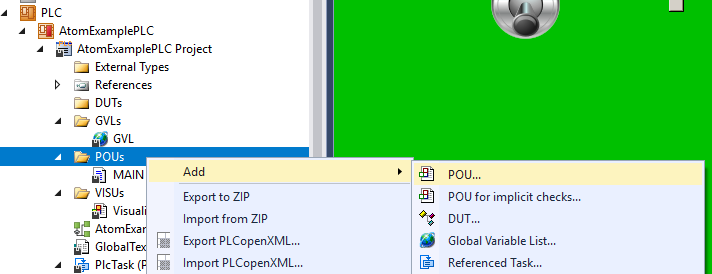

# TwinCAT 3
In this tutorial, you'll learn how to control ATOM over EtherCAT with TwinCAT 3.

:::info Note
If you'd like to skip this tutorial, download the completed example project: [AtomExampleTwinCat.zip](./assets/Atom.xml).
:::

:::info Note
If you are unfamiliar with TwinCAT 3, check out [PLC programming using TwinCAT 3 video series](https://www.youtube.com/watch?v=WkNOm-hMH3k&list=PLimaF0nZKYHz3I3kFP4myaAYjmYk1SowO) by Jakob Sagatowski.
:::

## Prerequisites
1. A PC with [TwinCAT 3 Engineering](https://www.beckhoff.com/en-en/products/automation/twincat/texxxx-twincat-3-engineering/te1000.html?) installed
   - We recommend using `TwinCat XAE Shell`:
   
   - This can be installed during the installation process:  
   
   - An Intel-based network interface:
   
   TwinCAT 3 requires an Intel-based network adapter to work properly.
2. _(Optional)_ A Beckhoff EtherCAT PLC (e.g., CX9020, CX5130)
   - TwinCAT 3 includes a built-in soft PLC simulator that you can follow along with. This tutorial will cover both options - using a PLC and using the soft PLC simulator.
3. Download ATOM's ESI file: [Atom.xml](./assets/Atom.xml)

## Hardware setup

:::info
To simplify this tutorial, we skip connecting a load to ATOM. The fieldbus configuration remains the same regardless of whether you connect a load or not.
:::

:::info
## EtherCAT ID switches

ATOM has two rotary switches that together set the EtherCAT ID. The EtherCAT ID is a two byte ID that unqiuely identifies ATOM on an EtherCAT network.

The `X1` rotary switch sets the low byte of the EtherCAT ID, and the `X10` rotary switch sets the high byte of the EtherCAT ID.

For example, when `X1` is set to `1` and `X10` is set to `2`, the EtherCAT ID is `0x21` (33 in decimal).

The EtherCAT ID is used for manual addressing of EtherCAT devices which is useful for seamless device replacement and consistent identification across restarts. In this example, we use TwinCAT's built in automatic addressing, so the EtherCAT ID switch positions don't matter.
:::

Connections:
- Connect port `X000` on your PLC to your PC with an Ethernet cable.
- Connect port `X001` on your PLC to the `IN` port on ATOM with an Ethernet cable.
- Connect 24V DC power to ATOM and your PLC.


## PLC configuration
:::note
You can skip this section if you are using the TwinCAT soft PLC simulator.
:::

1. If you are using a PLC, connect a monitor and keyboard to it and power it on.
2. Open Network Connection Manager, right-click the `X000` network interface, and select **Properties**:


3. In the **X000 Properties** dialog, select **Internet Protocol Version 4 (TCP/IPv4)** and click **Properties**:


4. In the **Internet Protocol Version 4 (TCP/IPv4) Properties** dialog, select **Use the following IP address** and enter the following values. Then click **OK**:
   - IP address: `192.168.2.100`
   - Subnet mask: `255.255.255.0`


## PC configuration
Back on your PC, follow these steps:

:::info
This uses a network adapter named `EtherCAT Network` to make it easy to remember and follow along. If your network adapter has a different name, use that instead.
:::

1. Navigate to your TwinCAT 3 installation directory (typically `C:\TwinCAT\3.1\System`) and execute `TcRteInstall.exe`. Ensure that the network adapter you intend to use appears under the **Installed and ready to use devices(realtime capable)** category.
   If it does not, select the network adapter and click **Install**:  
  

2. Place `Atom.xml` (from the [requirements](#requirements) section) in the `C:\TwinCAT\3.1\Config\Io\EtherCAT` directory. This is where TwinCAT looks for ESI files.

3. Navigate to your Settings app and locate your `EtherCAT Network` adapter. Right-click it and select **Edit**:

  

4. In the **EtherCAT Network Properties** dialog, set the `IP address` and `Subnet mask` to the following values. Then, hit **Save**.
   - IP address: `192.168.2.50`
   - Subnet mask: `255.255.255.0`

  

## Creating a TwinCAT 3 project

1. Open TwinCAT 3 and select **File** > **New Project**. Name it `AtomExampleTwinCAT` and click **OK**:


## Connecting to your PLC
:::note
If you are using the TwinCAT soft PLC simulator, you can skip this section.
:::

1. Select the target dropdown and click **Choose Target System...**:


2. Click **Search (Ethernet)**:


3. Select **Broadcast Search**:
  


4. Select the network adapter to search - pick the one labeled `192.168.2.50`:


5. Select your `PLC` from the list (it should have the IP address you configured [above](#plc-configuration): `192.168.2.100`). Under **Address Info** select **IP Address**, then click **Add Route**:


6. If you want to use `Secure ADS`, check `Secure ADS` and copy the `Check Fingerprint` value to the `Compare with` box. In **Remote User Credentials**, enter the username and password for your PLC, then click **OK**. If you haven't changed it, the default Beckhoff credentials are:
   - Username: `Administrator`
   - Password: `1`


7. If a password prompt appears, enter the same username & password for your PLC as in step 6. then click **OK**:


8. If everything worked correctly, you should see a check or X under the `Connected` column next to your PLC. If it does, hit **Close**:


9. Select the target dropdown and select your PLC (in our case, `CX-71B471`):


10. If everything worked correctly, you should see `CX-71B471` become the value in the dropdown with _no_ `(ERROR)` suffix:


## Adding and configuring Atom

1. Right-click **I/O** > **Devices** and select **Scan**:


2. Select the entry that reads `Device 3 (EtherCAT)` and click **OK** (this might be slightly different for you):


3. When prompted to **Scan for boxes**, select **Yes**:


4. If everything worked correctly, you should see `Device 3 (EtherCAT)` (your PLC) and `Box 1 (CCI Device)` (ATOM) in the **I/O Devices** tree. If you do not, see [troubleshooting](#troubleshooting).

:::info
If you are using the TwinCAT soft PLC simulator, you should only see `Box 1 (CCI Device)` in the **I/O Devices** tree.
:::


## Configuring your TwinCAT 3 project

1. Right-click **PLC** and select **Add New Item...**:


2. Select **Standard PLC Project**, name it `AtomExamplePLC`. Click **Add**:


3. Select **License** and click **7 Days Trial License...*. Then complete the CAPTCHA:


4. Select **Device 3 (EtherCAT)** and click **Sync Unit Assignment**:


5. Select **PlcTask** and hit **Apply**:
  


:::note
If you get an error message like "needs sync master (at least one variable linked to a task variable)", redo this step.
:::

6. Select **Build** > **Build Solution**. If you configured everything correctly, you should see a message like `Build succeeded` in the lower left and no error messages should pop up:


## Crash course in TwinCAT 3

Most actions can be performed from the **TwinCAT** menu in the top bar. Here are some of the most common actions:


- `1` - The TwinCAT build version to use. This should match the version of TwinCAT on your PLC.
- `2` - From left to right:
  - `Activate the configuration`: Loads the PLC project onto the PLC as the boot project (the project the PLC will auto-start when it boots)
  - `Run`: Puts the TwinCAT system into run mode, allowing the PLC to execute the project
  - `Config`: Puts the TwinCAT system into configuration mode, allowing you to modify the PLC project.
    - You may occasionally get a prompt reading `Activate free run?` - free run is a special PLC mode that allows you to edit EtherCAT variables on your I/O devices manually without having to put the PLC into run mode.
    - When adding new devices or installing new ESI files, you may need to click activate config mode even if config mode is already active. Clicking **Config** mode will restart the PLC in config mode.
- `3` - This is the PLC you want to program. `<Local>` is the built in soft PLC for testing & development.
- `4`: From left to right:
  - `Login` - Log in to download changes to the PLC and debug in real-time.
  - `Start` - Start PLC program execution.
  - `Stop` - Pause PLC program execution.
  - `Logout` - Log out of the PLC to make changes/modify the PLC program.
- `5`: Debugging tools. You can set breakpoints, step through code, force variables, and more.

If you install a new ESI file in `C:\TwinCAT\3.1\Config\Io\EtherCAT`, you may need to **Reload Device Descriptions** and restart the PLC in config mode:


When you login to the PLC, you may be prompted with this dialog:


- `Login with online change` - Changes you made to the project with be pushed in real-time to the PLC without restarting the current program. Essentially, this pushes the "delta-updates".
- `Login with download` - The entire project is re-downloaded to the PLC, overwriting & restarting whatever program was running.
- `Login without any change` - Do not download any changes you made to the PLC.
- `Update boot project` - Update the default boot project to the one you are downloading.

## A basic example program

1. Right-click **GVLs** and select **Add** > **Global Variable List**. Name it `GVL` and click **Add**:


2. Create three variables:

```structured-text
  // Inputs
  ATOM_AC_LINE AT %I* : UINT; // AC Line Voltage in Volts as reported by ATOM

  // Outputs
  ATOM_SETPOINT AT %Q* : UINT; // The setpoint/output command to ATOM
  ATOM_RUN_ENABLE AT %Q* : UINT; // Put ATOM in RUN/STOP
```


:::info
Global variables take the format:
`<NAME> AT %<I/Q>* : <DATA-TYPE>;`. Use `%I*` for inputs and `%Q*` for outputs. All ATOM EtherCAT variables are `UINT` (unsigned integers).
:::

3. You must build the project to register the global variables. Select **Build** > **Build Solution**. If you configured everything correctly, you should see a message like `Build succeeded` in the lower left and no error messages should pop up:


4. Right-click `Box 1 (CCI Device)` > `Inputs` > `Line Voltage` and select **Change Link...*:


5. Select the corresponding global variable `GVL.ATOM_AC_LINE` and click **OK**:


6. Repeat the process for `Outputs` > `Setpoint` and `Outputs` > `Digital Run Enable`:


7. Select the main program `MAIN (PRG)` and add the following code:

```structured-text
// Command the Atom FULL ON
GVL.ATOM_RUN_ENABLE := 1;
GVL.ATOM_SETPOINT := 10000;

// Print the AC line voltage:

ADSLOGDINT(
  msgCtrlMask := ADSLOG_MSGTYPE_HINT,
  msgFmtStr := 'AC Line Voltage: %d V',
  msgArgs := GVL.ATOM_AC_LINE
);
```


8. Activate the configuration:
   


9. Check **Autostart PLC Boot Project(s)** and click **OK**:


10. When prompted to **Restart TwinCAT System in Run Mode**, click **Yes**:


11. Login to the PLC by clicking the **Login** button in the top bar. You should see the AC Line Voltage updated in the debug window and printed to the console:
  


Additionally, if you connect to ATOM with Control Panel over USB, you can see the ATOM went into RUN mode and the output setpoint was set to `10000` (which is `100.0%` of the output):


Once you've verified that ATOM is working, you can comment out the code in `MAIN (PRG)`:


Next, we'll create a simple user interface to control ATOM. You can follow along with either the  [Structured Text](#structured-text) or [Ladder Logic](#ladder-logic) examples below.

### Structured Text

1. Define the variables:
```structured-text
// Outputs
  
TOGGLE_RUN_ENABLE : BOOL;
SETPOINT_PERCENT : UINT;

// Inputs

AC_LINE_VOLTAGE : UINT;
```

Add the following code:
```structured-text
IF TOGGLE_RUN_ENABLE THEN
	GVL.ATOM_RUN_ENABLE := 1;
ELSE
	GVL.ATOM_RUN_ENABLE := 0;
END_IF

GVL.ATOM_SETPOINT := SETPOINT_PERCENT * 100;

AC_LINE_VOLTAGE := GVL.ATOM_AC_LINE;
```


Next, head to the [interface section](#creating-a-simple-user-interface) to create a simple user interface to control ATOM.

### Ladder logic

Right click **POUs** and select **Add > POU...**



Set the name to `LadderLogicExample`, set type to `Program` and select **Ladder Logic Diagram (LD)** as the Implementation language:


Copy the following code into the top panel of the **LadderLogicExample** editor:
```structured-text
// ...
VAR_OUTPUT
	TOGGLE_RUN_ENABLE: BOOL;
  SETPOINT_PERCENT : UINT;
END_VAR

VAR_INPUT
	AC_LINE_VOLTAGE : UINT;
END_VAR
```

In the bottom panel of the editor, we'll create a simple ladder logic program using the variables we just added above.

1. Create **3** networks total by right-clicking and selecting **Insert Network**
2. For each network, right click and insert **one** contact and **one** coil


After you're finished, your ladder logic program should look like:


For each rung, replace the `???` with the corresponding variables:

1. **Rung #1** - `BOOL_TO_UINT(TOGGLE_RUN_ENABLE)` and `GVL.ATOM_RUN_ENABLE`
2. **Rung #2** - `SETPOINT_PERCENT * 100` and `GVL.ATOM_SETPOINT`
3. **Rung #3** - `GVL.ATOM_AC_LINE` and `AC_LINE_VOLTAGE`

After you're finished, your ladder logic program should look like:


Next, head to the [interface section](#creating-a-simple-user-interface) to create a simple user interface to control ATOM.

### Creating a user interface

1. Right click **VISUs** and select **Add > Visualization...**:


2. Name it `Visualization` and check **Active** on `VisuSymbols (System)`, then hit `Open`:
  


3. Select components in to the toolbox on the right and drag them onto the canvas:


4. In this example, we will add:
   - A **Dip switch** to toggle the `Run Enable` state
   - A **Slider** to set the output setpoint percentage
   - A **Meter** to display the AC line voltage


5. Connect the components to the variables we defined earlier:
   - For the **Dip switch**, set the `Variable` property to `MAIN.TOGGLE_RUN_ENABLE`, if using structured text, or `LadderLogicExample.TOGGLE_RUN_ENABLE` if using ladder logic.
   - For the **Slider**, set the `Variable` property to `MAIN.SETPOINT_PERCENT`, if using structured text, or `LadderLogicExample.SETPOINT_PERCENT` if using ladder logic.
   - For the **Meter**, set the `Value` property to `MAIN.AC_LINE_VOLTAGE` if using structured text, or `LadderLogicExample.AC_LINE_VOLTAGE` if using ladder logic.


6. Build the project and hit **Login**. Select **Login with online change** and click **OK**:


7. If everything worked correctly, you should see the ATOM's AC line voltage in the meter, and you can toggle the run enable state and set the output setpoint percentage using the dip switch and slider, respectively:


## Troubleshooting
- My ATOM does not appear in the TwinCAT I/O Devices tree.
  - Ensure that ATOM is powered on and connected to the same network as your PC.
  - Check that the `Atom.xml` file is in the correct directory: `C:\TwinCAT\3.1\Config\Io\EtherCAT`.
  - Ensure that you have installed the ESI file correctly and reloaded the device descriptions in TwinCAT.
  - Check the network cable connection between your PC, ATOM, and PLC.
- I cannot connect to my PLC.
  - Ensure that the PLC is powered on and connected to the same network as your PC.
  - Check that you have configured the correct IP address and subnet mask for both the PLC and your PC.
  - Ensure that you have the correct username and password for your PLC.
- My variables are missing or an ESI file is working:
  - Select Reload Device Descriptions from the TwinCAT menu bar.
  - Click Config to restart the PLC in config mode.
  - Select the *Activate the configuration* button in the TwinCAT menu bar.

### Can't connect to PLC or ATOM

Use the `ping` utility on Windows to check if your PC can reach the PLC/ATOM:


If:
- Ping is successful - you have a configuration problem with your PC
- Ping is unsuccessful - you have a hardware configuration, PLC configuration, or ATOM configuration problem.


## Advanced
ATOM supports `FOE` (File Over EtherCAT) for firmware updates. If you receive a firmware update file from Control Concepts, you can update ATOM's firmware using TwinCAT 3:

