# Codesys

In this tutorial, you'll learn how to use Codesys with the SoftPLC emulator to connect to ATOM using EtherNet/IP and perform some
basic operations and monitor data. You can follow along using the SoftPLC emulator or your own PLC.

We provide examples for both ladder logic and structured text.

If you haven't yet, please review ATOM's [EtherNet/IP Profile](./overview).

If you'd like to skip the tutorial, you can download a completed example project:

- Download [ATOM_Codesys_LadderLogic_Example.zip](./assets/codesys/ladder/ATOM_Codesys_LadderLogic_Example.zip)
- Download [ATOM_Codesys_StructuredText_Example.zip](./assets/codesys/structured-text/ATOM_Codesys_StructuredText_Example.zip)

## Prerequisites
1. Install [Codesys](https://www.codesys.com/download.html)
2. Download ATOM's [EDS file](./assets/ATOM.eds)

## Hardware setup
Connect 24V to your PLC and Atom unit with the provided power cable. Connect Atom to your PC with an Ethernet cable.


:::info
To simplify this diagram, we have not connected a load to Atom. You may connect a load or leave it disconnected, either way is fine
for the purposes of this tutorial. 

If you do not connect a load, you can still verify your PLC is working by connecting a USB
cable to Atom and using Control Panel to watch the parameters change/verify the PLC is receiving the correct monitor data.
:::

## Configuring Atom network settings
Connect your Atom unit to your PC using a USB cable. Open Control Panel and update your Atom's communication parameters. When you're finished,
click **Send IP Address**, then go to **Actions** in the upper right and select **Store Parameter Values to EEPROM**:


## Create a Codesys project
Create a new Codesys project using the **Standard project with Application Composer** template:


Check each library to include it in the project and select **CODESYS Control WIN V3 x64** as the device:

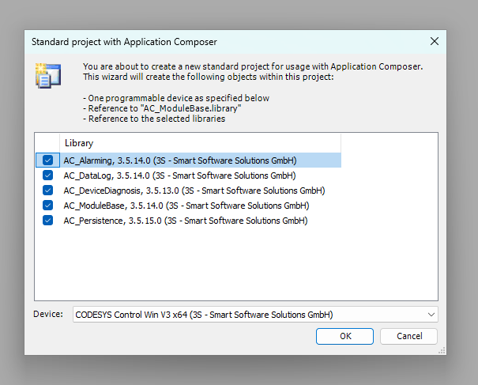

## Adding an EtherNet/IP Scanner
Next we'll add an EtherNet/IP Scanner module. This allows the PLC to discover EtherNet/IP devices on the network (in our case, ATOM) and establish a connection with them.

First, right click **Device** and select **Add Device**:


Next, expand **Ethernet Adapter** and select **Ethernet**, then click **Add Device**:


The newly added **Ethernet** device will now appear in the device tree. Double click **Ethernet (Ethernet)** to open its configuration tab.
Within the **General** configuration tab, use the button indicated by the red arrow to select the network interface of the host machine that will
be used to communicate with ATOM. In our case, we have a `TEST-NET` interface but this will be different for you.

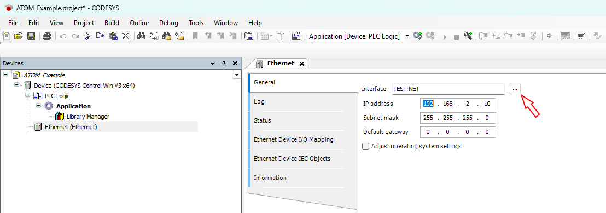

Next, right click **Ethernet (Ethernet)** and select **Add Device**:

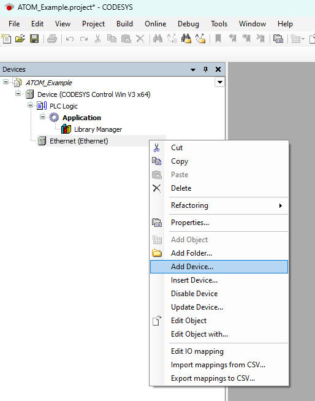

Expand **EtherNet/IP Scanner**, select **EtherNet/IP Scanner**, then click **Add Device**:


Your device tree should update to include the **EtherNet/IP Scanner** device.

## Adding ATOM to the scanner

First, we'll import ATOM's EDS file you downloaded [earlier](#prerequisites) into our Codesys device library.
Open the tools menu and select **Device repository**:

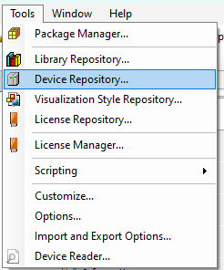

Next, click **Install** and select the `ATOM.eds` file. After you click install,
**Atom** will appear under the **EtherNet/IP Remote Adapter** category. Click **Close** to dismiss the dialog:


Now, we'll add ATOM to the scanner. Right click **EtherNet/IP Scanner (EtherNet/IP Scanner)** and select **Add Device**:

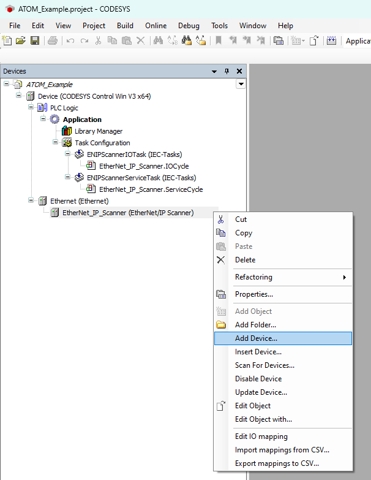

Expand **EtherNet/IP Remote Adapter** and select **Atom**, then click **Add Device**:


Finally, double click **Atom (Atom)** to open its configuration tab. In the **General** tab, set the **IP Address** to the IP address of your ATOM device:


## Create a program

Next, we'll create a PLC program. We provide examples for both ladder logic and structured text:

- [Program with ladder logic](#example-ladder-logic)
- [Program with structured text](#example-structured-text)

## Example: Ladder logic

### Creating the program

Right click **Application** and select **Add Object > POU**:


Set the name to `AtomProgram` and select **Ladder Diagram (LD)** as the Implementation language:


Copy the following code into the top panel of the **AtomProgram** editor:
```
PROGRAM AtomProgram
VAR
	
RUN_SWITCH: BOOL;
SETPOINT: DINT;
TEMP: REAL;

ATOM_OUTPUT_SETPOINT: DINT;
ATOM_OUTPUT_RUN_ENABLE: BOOL;
ATOM_INPUT_TEMP: REAL;

END_VAR
```

After you've copied the code over, the editor for **AtomProgram** should look like this:


In the bottom panel of the editor, we'll create a simple ladder logic program using the variables we just added above.

1. Create **3** networks total by right-clicking and selecting **Insert Network**
2. For each network, right click and insert **one** contact and **one** coil


After you're finished, your ladder logic program should look like:


For each rung, replace the `???` with the corresponding variables:

1. **Rung #1** - `RUN_SWITCH` and `ATOM_OUTPUT_RUN_ENABLE`
2. **Rung #2** - `SETPOINT` and `ATOM_OUTPUT_SETPOINT`
3. **Rung #3** - `ATOM_INPUT_TEMP` and `TEMP`

After you're finished, your ladder logic program should look like:


Finally, we'll add a task to call **AtomProgram** from the PLC's control loop:

Right click **Task Configuration** and select **Add Object > Task**:


Name your task `AtomTask` and click **OK**:


Next, double click **AtomTask (IEC-Tasks)** to open its configuration tab. Click **Add Call** and select **Application > AtomProgram**. After doing so, AtomTask's configuration should look like:


### Setting up visualization

Next, we'll set up a simple visualization display to control and monitor ATOM.

Right click **Application** and select **Add Object > Visualization**:


Make sure to check **Active** for **VisuSymbols (System)**, then click **Add**:


Name your visualization `AtomVisualization` and click **Add**:


Double click **AtomVisualization** to open its configuration editor. From the **Visualization ToolBox** panel
on the right, select the **Lamps/Switches/Bitmaps** category and add a lamp and a dip switch:


Next, in the **Common controls** category, add a slider:


Finally, in the **Measurement controls** category, add a meter:


### Wiring up the controls

Next, we'll connect the controls to our PLC program. Select the dip switch and set
the **Variable** field to `AtomProgram.RUN_SWITCH` as indicated by the red arrow:


Select the lamp and set the **Variable** field to `AtomProgram.RUN_SWITCH` as indicated by the red arrow:

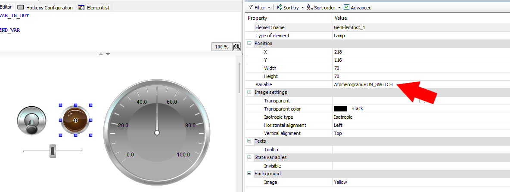

Select the slider and set the **Variable** field to `AtomProgram.SETPOINT` and set **Scale end** to `10000`: 

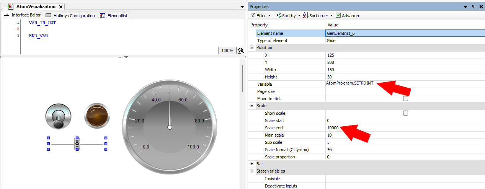

Select the meter and set the **Variable** field to `AtomProgram.TEMP`:


### Mapping variables

Finally, we'll map our PLC variables to ATOM. Double click **Atom** in the device tree to open its configuration window.
Select the **EtherNet/IP I/O Mapping** tab and set **Filter** to **Show only inputs**:


Above, select the button indicated by the red arrow. This will open the **Input Assistant** dialog. Select
**Application > AtomProgram > ATOM_INPUT_TEMP** and click **Add**:


After doing so, your input I/O mappings should look like:


Change the **Filter** to **Show only outputs** and repeat the process for the outputs. Map **Digital setpoint**
to `Application.AtomProgram.ATOM_OUTPUT_SETPOINT` and **Digital RUN Enable** to `Application.AtomProgram.ATOM_OUTPUT_RUN_ENABLE`.

:::warning Take care
Make sure you map **Bit0** of **Digital RUN Enable** to **ATOM_OUTPUT_RUN_ENABLE**, NOT **Digital RUN Enable** itself.
:::


## Example: Structured text

### Creating the program

Right click **Application** and select **Add Object > POU**:


Name your **POU** `AtomProgram` and select **Structured Text (ST)** as the language:


Next, let's create a basic program. We'll check to make sure no alarms are active and then write a setpoint value of `8000` and set run enable to `true`.

Copy the following code into the top panel of the **AtomProgram** editor:
```
PROGRAM AtomProgram
VAR
	
ATOM_OUTPUT_SETPOINT: BOOL;
ATOM_OUTPUT_RUN_ENABLE: BYTE;
ATOM_INPUT_INHIBIT_ALARM: BYTE;

END_VAR
```

Copy the following code into the main program section:
```
IF (ATOM_INPUT_INHIBIT_ALARM = 0) THEN
	ATOM_OUTPUT_SETPOINT := 8000;
	ATOM_OUTPUT_RUN_ENABLE := true;
END_IF
```

Your editor should look like:

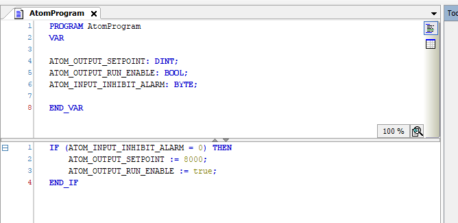

Next, we'll add a new task to call our program. Right click **Task Configuration** and Select **Add Object > Task**:


Name your task `AtomTask` and click **Add**:


Next, double click **AtomTask (IEC-Tasks)** to open its configuration tab. Click **Add Call** and select **Application > AtomProgram**.
After doing so, **AtomTask**'s configuration should look like:


### Mapping variables

Next, we'll map our ATOM's I/O configuration to our program variables. Double click **Atom (Atom)** to open its configuration window,
then select the **EtherNet/IP I/O Configuration** tab. On the **Filter** dropdown indicated by the red arrow, select **Show only outputs**:


Click the button indicated by the red arrow to map the **Digital setpoint** value:


This button will open the **Input Assistant** dialog. Select the corresponding variable from your program and click **Ok**:

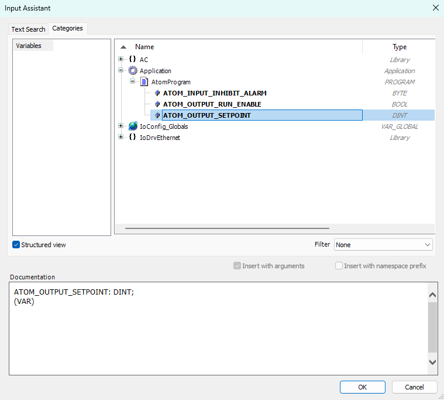

Repeat this process so that your output variables are mapped like so:

:::warning Take care
Make sure you map **Bit0** of **Digital RUN Enable** to **ATOM_OUTPUT_RUN_ENABLE**, NOT **Digital RUN Enable** itself.
:::


Switch the filter to **Show only inputs** and then map the **Inhibit alarm status** variable:


## Running the program with SoftPLC
:::info
The instructions to run your program are the same regardless of whether you are using ladder logic or structured text.

The only difference is that in the ladder logic example, a visualization window will open that allows you to control ATOM.
:::

To debug the program, first make sure you start **Codesys WIN Control V3 - x64 SysTray**

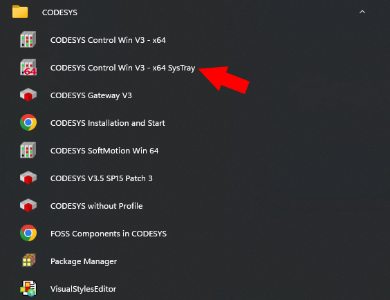

This will launch the Codesys SoftPLC. You should see an icon appear in your systray and you can right click it and select **Start PLC** to start the SoftPLC:

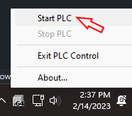

Next, in Codesys double click **Application** to open its configuration window. Here you can select **Scan Network**
to discover your SoftPLC:


Finally, **Login** to your SoftPLC:


Then you can start debugging the program:


If you use Control Panel to monitor ATOM, you should see the **Stop / Run** state and the **Digital Setpoint** values change to reflect
the PLC program's instructions. If you followed the structured text example, the values will change once and remain fixed. If you followed
the ladder logic example, a visualization control panel will appear. Flipping the dip switch or adjusting the slider will immediately update
ATOM and the changes should reflect in real-time:

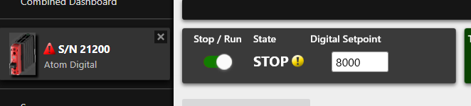