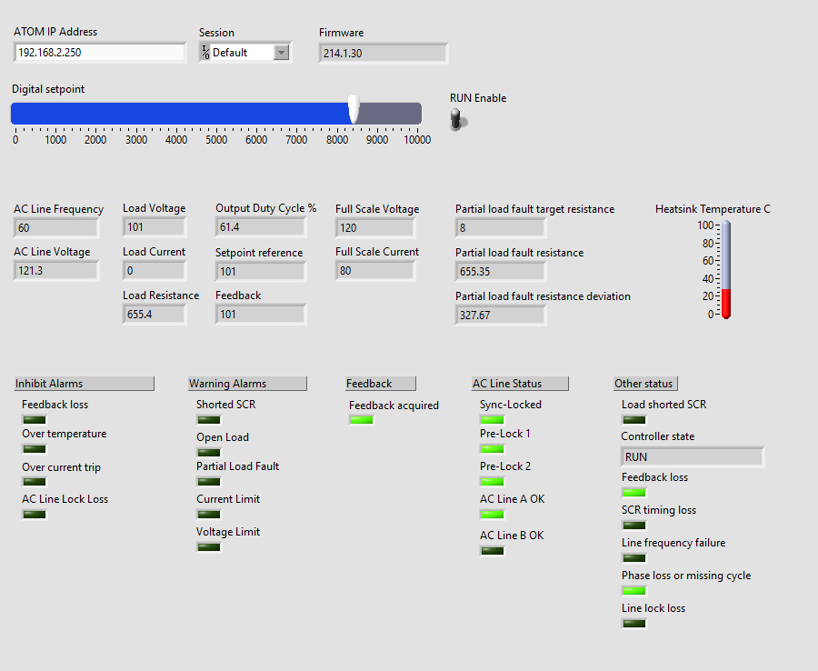
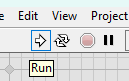
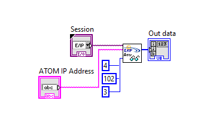
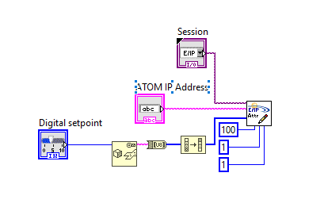

# Labview

:::info Note
You do NOT need to purchase the [NI-Industrial Communications for EtherNet/IP](https://www.ni.com/en-us/shop/software/products/ni-industrial-communications-for-ethernet-ip.html) add-on.

This is only used if you want your Labview application to operate as an EtherNet/IP adapter device. In our case, Labview will operate as a scanner that connects
to ATOM to control it. This functionality is included in the default version of Labview.
:::

:::info Note
We use **explicit messaging** to connect to ATOM from Labview because Labview does not support I/O connections.
:::

## Using our pre-built VI

Download our ATOM control panel VI to quickly control and monitor ATOM from Labview.

Most of the parameters listed in our [EtherNet/IP Profile](./overview) are available through the VI controls, although you can easily
extend or alter the VI to suite your needs.

[Download ATOM.vi](./assets/labview/ATOM.vi)

To setup the VI, enter the IP address of your ATOM unit in the **ATOM IP Address** box. Below, we've entered `192.168.2.250` as the IP address. You can check or change
your ATOM's IP address by using [Control Panel](https://ccipower.com/products/accessories/control-panel-software).



After you've set the IP address, you can run the VI by clicking the run icon:



After the VI starts, you can adjust the Digital setpoint and RUN Enable controls. All the other indicators will update every 500 ms to reflect the current state of the ATOM unit.

## Advanced

### Reading and parsing data from ATOM

If you need to modify or extend the VI that we provide, this section is provided to help make it easier.

The main way to pull data from ATOM is by fetching the _producing_ assembly object (class 4, instance 102, attribute 3) using the Get Attribute Single service (0x0E).

Below is a simple example of fetching ATOM's assembly object. After this block diagram executes, `Out data` will be a byte array of length `86` containing
the 30 parameters listed in ATOM's [EtherNet/IP Profile](./overview):



To pull a parameter out of this byte array, you can calculate its index within `Out data` by finding the sum of the parameter data type sizes before it.

:::note Example
To pull out the AC Line Voltage parameter, we can calculate the sum of the parameter data type sizes before it.
AC Line Voltage is parameter #7, so we sum the size of the first 6 parameters, which each have sizes of:
```
Digital setpoint = DINT = 4 bytes
Digital run enable = BOOL = 1 byte
Inhibit alarm status = BYTE = 1 byte
Warning alarm status = BYTE = 1 byte
Feedback read setatus = BOOL = 1 byte
AC Line Frequency = REAL = 4 bytes
```
Summing these up, we get:
```
4 (DINT) + 1 (BOOL) + 1 (BYTE) + 1 (BYTE) + 1 (BYTE) + 4 (REAL) = 12
```

AC Line Voltage itself is a `REAL`, so AC Line Voltage resides at index `12` within `Out data` and extends for `4` bytes.

To properly display this within your VI, you will need to reverse the order of these four bytes before interpreting them
as a single precision decimal in Labview. This is because Labview is by default big-endian, while ATOM is little-endian.
:::

### Writing data to ATOM
Below is a simple diagram that updates the digital setpoint parameter on ATOM.

An alternative method to this one is to compile together an assembly object and use the Set Attribute Single service (0x10) to
write to the consuming assembly object (class 4, instance 101, attribute 3). The one downside to this is that it requires you to send all parameters within
the consuming assembly object together.

Instead, we provide the custom ParameterLink object (class 100, instance `i`, attribute 1), where `i` is the parameter number you wish to interact with.
Below, we write to ParameterLink instance `1`, attribute `1`. Consult the [EtherNet/IP Profile](./overview) to determine the data type of the parameter you wish to
write. Here, we're writing digital setpoint, which is a `DINT`, so we'll make sure that we use an `i32` in Labview. Note that before we write the data,
we have to reverse the bytes as Labview is by default big-endian, while ATOM is little-endian:

