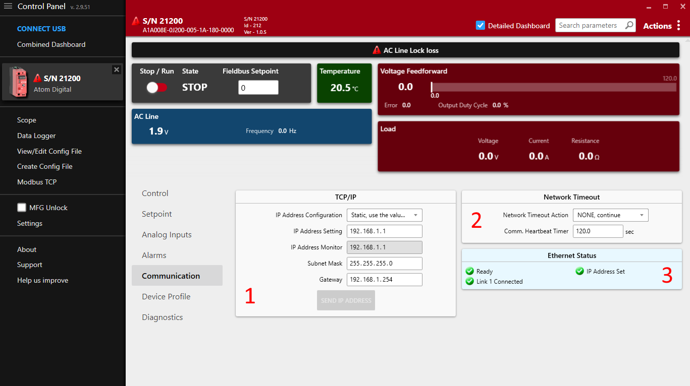

# Overview
Atom supports the following ModbusTCP operations:
- Read Holding Registers (Function code `3`)
- Write Single Holding Register (Function code `6`)
- Write single coil/command (Function code `5`)

:::info
ModbusTCP is always available and running, even if you're using Profinet or EtherNet/IP. ModbusTCP exposes more parameters than the other fieldbus protocols and may be
useful for more advanced configuration.
:::

## Control Panel Communication Settings

Some communication settings can be configured in the **Communication** tab in [Control Panel](/control-panel/overview).

- Section `1`: TCP/IP settings
  - **IP Address Configuration**
    - `Static`: Use the IP address, subnet mask, and gateway specified below.
    - `DHCP`: Use DHCP to obtain an IP address.
  - **IP Address Setting**: The IP address of the ATOM controller.
  - **IP Address Monitor**: The current IP address of the ATOM controller.
  - **Subnet Mask**: The subnet mask of the ATOM controller.
  - **Gateway**: The gateway address for the ATOM controller.
- Section `2`: Network Timeout
  - The EtherNet/IP heartbeat timeout (Encapsulation Inactivity Timeout) in seconds.
  - You can configure a network timeout action to perform when the device loses communication with the PLC:
    - `None`: Do nothing
    - `STOP, fault shutdown`: STOP the controller, disabling output
    - `Use network timeout setpoint`: Configure an alternative setpoint to use when the controller loses communication with the PLC.
- Section `3`: Ethernet status
  - Indicates the status of both RJ45 ports, IP address configuration, conflict detection, and any other errors with the EtherNet/IP connection.

:::info
## Control Panel and PLC software

These settings are synchronized with your PLC environment. You do not have to use Control Panel to change these settings - you can stay in your PLC software.
Control Panel merely provides them as an altnerative way to configure ATOM's EtherNet/IP settings.

You can use Control Panel simultaneously with your PLC software without issues.
:::

:::warning
## IP Address Conflict Detection

ATOM uses **IP Address Conflict Detection** to detect IP address conflicts on the network. If ATOM detects another device using the same IP address, it will disable all network communication until the conflict is resolved.

Please ensure all devices on the network are assigned unique a IP address.
:::

## Hardware considerations

:::warning
## Daisy chaining

As ATOM has two RJ45 ports, it can be easily daisy-chained. When daisy-chaining ATOM, take care to avoid a loop in the network. In some loop configurations, ATOM is susceptible to
network broadcast storms, which can cause the controller to become unresponsive. If you are daisy-chaining ATOM, ensure that the network is loop-free.

ATOM works with both unmanaged and managed switches. We recommend a managed switch for larger networks to give you more control over the network topology.
:::

## Registers

|Register #|Name|Default|Min|Max|Scale|Unit|Read/Write|Notes|
|---|---|---|---|---|---|---|--|-|
|2|Feedback Type|1|1|2|||Read/Write|
|3|Firing Mode|5|1|6|||Read/Write|
|4|Slew Rate|10|1|100|||Read/Write|Single phase only|
|5|Control Loop|1|0|1|||Read/Write|
|6|Full Scale Voltage|480.0|10.0|600.0|10|v|Read/Write|
|7|Full Scale Current|80.0|2.0|100.0|10|A|Read/Write|
|8|Voltage Limit|700|10|700||v|Read/Write|
|9|Current Limit|84.0|1.0|105.0|10|A|Read/Write|
|10|Current Trip|240|5|245|1|A|Read/Write|
|11|Analog Setpoint Zero threshold|0|0|0|||Read/Write|
|12|Analog Setpoint Type|0|1|2|||Read/Write|
|13|Analog Setpoint Low Cmd|0.00|-5.00|25.00|100|v, ma|Read/Write|
|14|Analog Setpoint Low Out|0.00|0.00|125.00|100|%|Read/Write|
|15|Analog Setpoint High Cmd|0.00|-5.00|25.00|100|v,ma|Read/Write|
|16|Analog Setpoint High Out|0.00|0.00|125.00|100|%|Read/Write|
|17|Partial Load Fault Enable|0|0|1|||Read/Write|
|18|PLF Tolerance|8.0|0.0|100.0|10|%|Read/Write|
|19|Partial Load Fault Resistance|8.00|0.10|655.35|100|ohm|Read/Write|
|20|PLF Alarm Delay time|10|1|120||sec|Read/Write|
|21|Relay Alarm Mask|384|0|65535|||Read/Write|
|22|Shorted SCR detect enable|0|0|2|||Read/Write|
|23|Open Load detect enable|0|0|1|||Read/Write|
|24|Digital Setpoint 1 (EEPROM)|0|0|10000|||Read/Write|
|25|Digital Setpoint 2 (RAM) 1|0|0|10000|||Read/Write|
|26|Digital RUN Enable|0|0|1|||Read/Write|
|27|Setpoint Select|2|2|2|||Read/Write|
|28|Digital RUN Enable power-up default|0|0|1|||Read/Write|
|29|PLF Teach Enable|0|0|1|||Read/Write|
|30|Communications Heartbeat Time|0|0|65535|||Read/Write|
|31|Network Timeout Action|0|0|2|||Read/Write|
|32|Network Timeout Setpoint|0|0|10000|||Read/Write|
|33|IP Address Configuration method|1|0|1|||Read/Write|
|34|IP Address, OCTET 1|192|0|255|||Read/Write|
|35|IP Address, OCTET 2|168|0|255|||Read/Write|
|36|IP Address, OCTET 3|71|0|255|||Read/Write|
|37|IP Address, OCTET 4|250|0|255|||Read/Write|
|38|Subnet Mask, OCTET 1|255|0|255|||Read/Write|
|39|Subnet Mask, OCTET 2|255|0|255|||Read/Write|
|40|Subnet Mask, OCTET 3|255|0|255|||Read/Write|
|41|Subnet Mask, OCTET 4|0|0|255|||Read/Write|
|42|Gateway IP Address, OCTET 1|192|0|255|||Read/Write|
|43|Gateway IP Address, OCTET 2|168|0|255|||Read/Write|
|44|Gateway IP Address, OCTET 3|0|0|255|||Read/Write|
|45|Gateway IP Address, OCTET 4|100|0|255|||Read/Write|
|46|Relay Normal State|0|0|1||sec|Read/Write|
|||**Format**||
|201|Active Setpoint|X|||||Read|
|202|Analog Setpoint %|SXXX.X|||10|%|Read|
|203|Analog Setpoint Cmd|SXXX.X|||10|V,A|Read|
|204|Analog Setpoint Signal|SXX.XX|||10|v,ma|Read|
|205|Inhibit Alarm Status|XXXXXXXX|||||Read|See [bitfield](#inhibit-alarm-status)|
|206|Controller Status|X|||||Read|See [values](#controller-status)|
|207|AC Line Frequency|XX.X|||10|Hz|Read|
|208|Line Voltage|XXX.X|||10|V|Read|
|209|Load Voltage|XXX.X|||10|V|Read|
|210|Load Current|XXX.X|||10|A|Read|
|211|Load Resistance|XXXX.X|||10|ohm|Read|
|212|Heatsink temp|XXX.X|||10|C|Read|
|213|Controller State|X|||||Read|See [values](#controller-state)|
|214|Output Duty Cycle %|XXX.X|||10|%|Read|
|215|Setpoint Reference|XXX.X|||10|V,A|Read|
|216|Feedback|XXX.X|||10|V,A|Read|
|217|Control Loop Error|SXXX.X|||10|V,A|Read|
|218|Warning Alarm Status|XXXXXXXX||||100|Read|See [bitfield](#warning-alarm-status)|
|219|Partial Load Fault Target Res|XXX.XX|||100|ohm|Read|
|220|Partial Load Fault Resistance|XXX.XX|||100|ohm|Read|
|221|PLF Resistance Deviation|SXXX.X|||10|%|Read|
|222|Partial Load Fault Status|XXXXXXXX|||||Read|
|||||
|310|In Service Time HI|XXXXXXXXXX|||||Read|
|311|In Service Time LO||||||Read|
|312|Processor Temperature|XXX.X|||10|C|Read|
|||||
|330|EE Calibration bits|XXXX|||||Read|
|331|Calibration ADC bits In|XXXX|||||Read|
|332|Firmware ID|XXXXX|||||Read|
|333|Firmware Revision|XX.XX|||100||Read|
|334|Minor Revision|XX|||||Read|
|335|Feedback Read status|X|||||Read|See [bitfield](#feedback-alarm-status)|
|336|Misc Status|XXXXXXXX|||||Read|See [bitfield](#miscellaneous-status)|
|337|EEPROM Status|XXXXXXXXXXXXXXXX|||||Read|See [bitfield](#eeprom-status)|
|338|AC Line Status|XXXXXXXX|||||Read|See [bitfield](#ac-line-status)|
|339|Load Status|XXXXXXXX|||||Read|
|340|Error Latch|XXXXXXXX|||||Read|See [bitfield](#error-latch)|
|341|Ethernet status|XXXXXXXXXXXXXXXX|||||Read|See [bitfield](#load-status)|
|342|Network Heartbeat Timer|XXXXX|||||Read|
|343|IP Address in use, OCTET 1|XXX|||||Read|
|344|IP Address in use, OCTET 2|XXX|||||Read|
|345|IP Address in use, OCTET 3|XXX|||||Read|
|346|IP Address in use, OCTET 4|XXX|||||Read|

### Additional parameter descriptions

#### Inhibit Alarm Status
Inhibit alarm status is a 8-bit bitfield:

|7|6|5|4|3|2|1|0|
|-|-|-|-|-|-|-|-|
|Reserved|Reserved|Reserved|Reserved|Feedback Loss|Over Temperature|Over Current Trip|AC Line Lock Loss|

If any bit is set to 1, the controller will _not_ be allowed to run.

#### Warning Alarm Status
Warning alarm status is a 8-bit bitfield:

|7|6|5|4|3|2|1|0|
|-|-|-|-|-|-|-|-|
Reserved|Reserved|High temperature|Shorted SCR|Open Load|Partial Load Fault|Current Limit|Voltage Limit|

Warning alarms are not considered critical and will not prevent the controller from running.

#### Feedback Read Status
Feedback status is a 8-bit bitfield:

|7|6|5|4|3|2|1|0|
|-|-|-|-|-|-|-|-|
|Reserved|Reserved|Reserved|Reserved|Reserved|Reserved|Reserved|Timeout|

Indicates whether the controller has acquired feedback on the line. If any bit is set to 1,
then the controller has lost feedback.

#### AC Line Status 
AC Line status is a 8-bit bitfield:

|7|6|5|4|3|2|1|0|
|-|-|-|-|-|-|-|-|
|Reserved|Reserved|Sync-Locked (to AC Line)|Pre-Lock 2|Pre-Lock 1|Reserved|AC Line B OK|AC Line A OK|

Bits 5 must be set to 1 before the controller can provide power to the load.

#### Load Status 
Load status is a 8-bit bitfield:

|7|6|5|4|3|2|1|0|
|-|-|-|-|-|-|-|-|
|Reserved|Reserved|Reserved|Open Load|Reserved|Reserved|Reserved|Shorted SCR|
#### Controller Status 
Controller status is one of:

|Value|Description|
|-|-|
|0|Disabled|
|1|Initialization|
|2|Normal, operating|
|3|Calibration|
|4|Diagnostic|
#### Controller State 
Controller state is one of:

|Value|State|Description|
|-|-|-|
|0|STOP|The state the controller is in when AC Line voltage is not present.|
|1|RUN|The state the controller is in when AC Line voltage is present and the controller is synchronized to the AC line.|
|2|FAULT|A latching state of output shutdown caused by over current or over temperature alarms. A power cycle or processor reset is required to clear this state.|
|3|FAULT RESET|Used as a temporary state to transition from FAULT to RUN once again.|
#### EEPROM Status
EEPROM status is an 16-bit bitfield. EEPROM is used to store controller configuration and calibration data. Any errors
in EEPROM may indicate that the firmware is corrupted.

|Bit|Description|
|-|-|
|0|EEPROM Initialization|
|1|SP Table Error|
|2|MFG CP Table Error|
|3|Calibration Table Error|
|4|Reserved|
|5|Reserved|
|6|Backup Calibration Table Error|
|7|Bottom Board Calibration Table Error|
|8|SP Definition Table needs updating|
|9|Bottom Board Calibration Backup Error|
|10|Reserved|
|11|Reserved|
|12|EEPROM is write protected|
|13|Reserved|
|14|Reserved|
|15|Feedback Calibration Table has changed, store to EEPROM|

#### Error Latch
Error latch is a 8-bit bitfield:

|7|6|5|4|3|2|1|0|
|-|-|-|-|-|-|-|-|
|Reserved|Reserved|Reserved|Feedback loss|SCR timing loss|Line Frequency failure|Phase loss or missing cycle|Line Lock Loss|

Error latch is provided as a diagnostic troubleshooting aid.

#### Miscellaneous Status
Miscellaneous status is an 8-bit bitfield:

|7|6|5|4|3|2|1|0|
|-|-|-|-|-|-|-|-|
|Reserved|Initialization in progress|Reserved|Reserved|Waiting for ENTER key during initialization|Reserved|USB Powered|Reserved|

### Data types
All Modbus registers are 2-bytes (WORD). 

Registers may be an unsigned integer (most commonly), bitfield, integer, bool, or decimal.

Most of these are straightforward. Decimals are stored as integers with a scale in our controllers.

The **Scale** column indicates how much you should _divide_ the value by when reading it, and how much you should _multiply_ it by when writing it.

## Commands
|CMD #|Name|Description|
|-|-|-|
|6|Factory reset|Reset to factory settings|
|13|Reset parameter|Resets user parameters to defaults|
|24|Store to EEPOM|Saves all parameters to permanent storage|
|198|Identify|Flashes LEDs on controller|
|248|Reset|Effectively restarts the controller|

## Miscallaneous
:::warning Important
You may notice that ModbusTCP parameter numbers are one less than the same parameters in other ATOM fieldbus profiles. This is because ModbusTCP uses zero-based addressing and subtracts
1 from all register numbers. The table above lists the actual register numbers you should use in your PLC project.
:::
