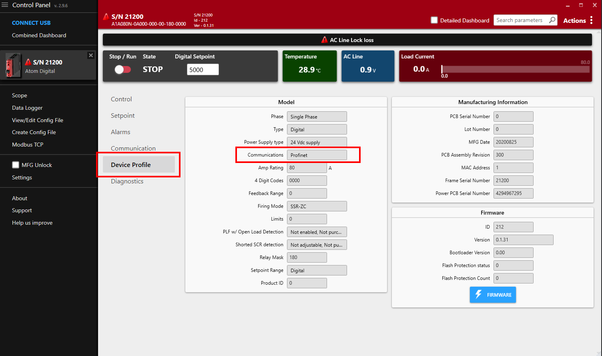
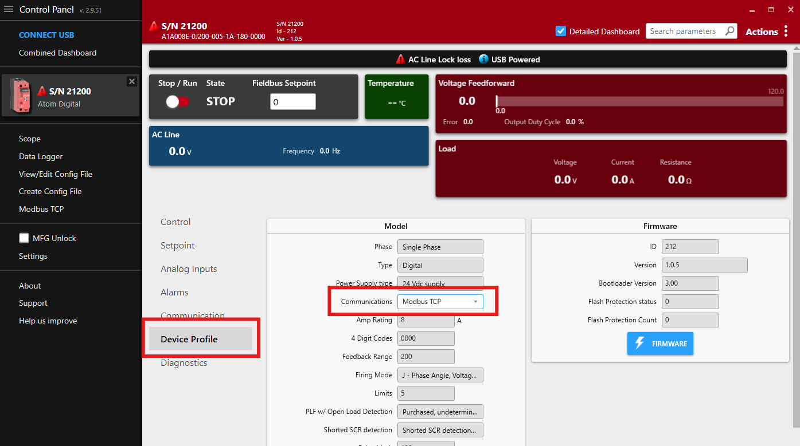

# Overview
ATOM implements the most popular industry standard fieldbus protocols to allow you to connect and integrate ATOM into
your power control systems quickly and easily. ATOM can be configured with EtherNet/IP, ModbusTCP, PROFINET, or
EtherCAT

:::info
Scan the QR code on your ATOM product label or use [this utility](https://ccipower.com) to determine which fieldbus your ATOM is configured for.
You can also check the **Device profile** tab in [Control Panel](https://ccipower.com/products/accessories/control-panel-software):

:::

:::info
ATOM can be ordered in the following configurations:

- Single phase (`1PH`)
  - Analog - Fieldbus not supported
  - Digital - ModbusTCP, EtherNet/IP, or Profinet
  - EtherCAT - EtherCAT only
- Three phase (`3PH`)
  - Analog - Fieldbus not supported
  - Digital - ModbusTCP, EtherNet/IP, or Profinet

ATOM _digital_ units can be configured for **ModbusTCP**, **EtherNet/IP**, or **Profinet** in software. Change the active fieldbus protocol
in the **Device profile** tab in [Control Panel](https://ccipower.com/products/accessories/control-panel-software). Changes to the active fieldbus take effect immediately &mdash; no reboot required.

:::

:::info
Learning resources

https://www.plcacademy.com
:::
