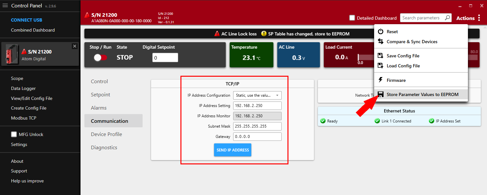

# Codesys

In this tutorial, you'll learn how to use Codesys with the SoftPLC emulator to connect to ATOM using Profinet and perform some
basic operations and monitor data. You can follow along using the SoftPLC emulator or your own PLC.

We provide examples for both ladder logic and structured text.

If you haven't yet, please review ATOM's [Profinet Profile](./overview).

If you'd like to skip the tutorial, you can download a completed example project:

- Download [ATOM_Codesys_Profinet_LadderLogic_Example.zip](./assets/codesys/ladder/ATOM_Codesys_Profinet_LadderLogic_Example.zip)
- Download [ATOM_Codesys_Profinet_StructuredText_Example.zip](./assets/codesys/structured-text/ATOM_Codesys_Profinet_StructuredText_Example.zip)

## Prerequisites
1. Install [Codesys](https://www.codesys.com/download.html)
2. Download ATOM's [GSDML file](./assets/ATOM-GSDML-20231108.zip)

## Hardware setup
:::warning Important
When Atom is configured for Profinet, the Ethernet port closest to the 24V power connector is **disabled**. You must use opposing Ethernet port
nearest the reset button as shown below or the PLC won't be able to connect to Atom.
:::

Connect 24V to your PLC and Atom unit with the provided power cable. Connect Atom to your PC with an Ethernet cable.


:::info
To simplify this diagram, we have not connected a load to Atom. You may connect a load or leave it disconnected, either way is fine
for the purposes of this tutorial. 

If you do not connect a load, you can still verify your PLC is working by connecting a USB
cable to Atom and using Control Panel to watch the parameters change/verify the PLC is receiving the correct monitor data.
:::

## Configure Windows firewall
Codesys requires you to allow incoming Profinet UDP packets through the Windows firewall so that the SoftPLC is able to receive
UDP Profinet requests from Atom.

1. First, search for **Windows Defender Firewall with Advanced Security** and open it:


2. Right click on **Inbound Rules** and select **New Rule**:


3. Select **Port**, then click **Next**:


4. Select **UDP**, then select **Specific local ports** and enter `34964, 49152-65535`, then click **Next**:


5. Select **Allow the connection**, then click **Next**:


6. Select which network types this rule applies to, then click **Next**:


7. Name the rule **Profinet**, then click **Finish**:


## Create a Codesys project
Create a new Codesys project using the **Standard project with Application Composer** template:


Check each library to include it in the project and select **CODESYS Control WIN V3 x64** as the device:


## Adding a Profinet Controller
Next we'll add a Profinet Controller device. This allows the SoftPLC to discover Profinet I/O devices on the network (in our case, ATOM) and establish a connection with them.

First, right click **Device** and select **Add Device**:


Next, expand **PROFINET IO > Ethernet Adapter** and select **Ethernet**, then click **Add Device**:


The newly added **Ethernet** device will now appear in the device tree. Double click **Ethernet (Ethernet)** to open its configuration tab.
Within the **General** configuration tab, use the button indicated by the red arrow to select the network interface of the host machine that will
be used to communicate with ATOM. In our case, we have a `TEST-NET` interface but this will be different for you.

:::info
Note, you may get an error dialog displaying "Gateway not configured properly". If this is the case, make sure your SoftPLC is online
by right-clicking the Codesys Win SysTray icon and starting the PLC. Navigate to the CODESYS Control Win V3 device in Codesys and use
**Scan Network** to make sure the gateway is detected. Then, you can select the network interface.
:::


Next, right click **Ethernet (Ethernet)** and select **Add Device**:


Expand **PROFINET IO > PROFINET IO Master**, select **PN-Controller** then click **Add Device**:


Your device tree should update to include the **PN-Controller** device.

## Adding ATOM to the controller

First, we'll import ATOM's GSDML file you downloaded [earlier](#prerequisites) into our Codesys device library.
Open the tools menu and select **Device repository**:


Next, click **Install** and select the `GSDML-V2.43-Control-Concepts-ATOM_20231108.xml` file. After you click install,
**Atom** will appear under the **PROFINET IO > PROFINET IO Slave > I/O** category. Click **Close** to dismiss the dialog:


Now, we'll add ATOM to the PN-Controller. Right click **EtherNet/IP Scanner (EtherNet/IP Scanner)** and select **Add Device**:


Expand **PROFINET IO > PROFINET IO Slave > I/O > CCI-ATOM** and select **ATOM SCR**, then click **Add Device**:


Finally, double click **Atom (Atom)** to open its configuration tab. In the **General** tab, set the **Station name**, **IP Address**, and **Subnet mask** for your ATOM SCR:

:::info
You can find or change these parameters in Control Panel, or using a tool like [Proneta](https://www.siemens.com/global/en/products/automation/industrial-communication/profinet/proneta.html).
Make sure your station name and IP settings on Atom are properly set to the same values you enter here so that Codesys can connect to ATOM.

**Proneta**

If you're using Proneta, make sure to change the IP settings with **Store permanently** checked.


**Control Panel**

Connect your Atom unit to your PC using a USB cable. Open Control Panel and update your Atom's communication parameters. When you're finished,
click **Send IP Address**, then go to **Actions** in the upper right and select **Store Parameter Values to EEPROM**:

:::


Next, right click **ATOM_SCR (ATOM SCR)** and select **Add Device**:


Here, you can choose which Profinet I/O modules to enable for your Atom. Select **DIO 8xLogicLevel** which allows both input and output of data to/from Atom. You
can add other I/O modules if needed. Then, click **Add Device**:


## Create a program

Next, we'll create a PLC program. We provide examples for both ladder logic and structured text:

- [Program with ladder logic](#example-ladder-logic)
- [Program with structured text](#example-structured-text)

## Example: Ladder logic

### Creating the program

Right click **Application** and select **Add Object > POU**:


Set the name to `AtomProgram` and select **Ladder Diagram (LD)** as the Implementation language:


Copy the following code into the top panel of the **AtomProgram** editor:
```
PROGRAM AtomProgram
VAR
    
RUN_SWITCH: BOOL;
SETPOINT: DINT;
TEMP: REAL;

ATOM_OUTPUT_SETPOINT: DINT;
ATOM_OUTPUT_RUN_ENABLE: USINT;
ATOM_INPUT_TEMP: REAL;

END_VAR
```

After you've copied the code over, the editor for **AtomProgram** should look like this:


In the bottom panel of the editor, we'll create a simple ladder logic program using the variables we just added above.

1. Create **3** networks total by right-clicking and selecting **Insert Network** three times.
2. For the first _two_ rungs (networks), insert a contact and a coil.


After you're finished, your ladder logic program should look like:


On the third rung, right click and select **Insert Box**:


Add a **TO_USINT** box:


For the first two rungs, replace the `???` with the corresponding variables:

1. **Rung #1** - `ATOM_INPUT_TEMP` and `TEMP`
2. **Rung #2** - `SETPOINT` and `ATOM_OUTPUT_SETPOINT`

On the third rung, set the input to `EN` to `TRUE` and set the input parameter to `RUN_SWTICH` and output parameter to `ATOM_OUTPUT_RUN_ENABLE`.
After you're finished, your ladder logic program should look like:


Finally, we'll add a task to call **AtomProgram** from the PLC's control loop:

Right click **Task Configuration** and select **Add Object > Task**:


Name your task `AtomTask` and click **OK**:


Next, double click **AtomTask (IEC-Tasks)** to open its configuration tab. Click **Add Call** and select **Application > AtomProgram**. After doing so, AtomTask's configuration should look like:


### Setting up visualization

Next, we'll set up a simple visualization display to control and monitor ATOM.

Right click **Application** and select **Add Object > Visualization**:


Make sure to check **Active** for **VisuSymbols (System)**, then click **Add**:


Name your visualization `AtomVisualization` and click **Add**:


Double click **AtomVisualization** to open its configuration editor. From the **Visualization ToolBox** panel
on the right, select the **Lamps/Switches/Bitmaps** category and add a lamp and a dip switch:


Next, in the **Common controls** category, add a slider:


Finally, in the **Measurement controls** category, add a meter:


### Wiring up the controls

Next, we'll connect the controls to our PLC program. Select the dip switch and set
the **Variable** field to `AtomProgram.RUN_SWITCH` as indicated by the red arrow:


Select the lamp and set the **Variable** field to `AtomProgram.RUN_SWITCH` as indicated by the red arrow:


Select the slider and set the **Variable** field to `AtomProgram.SETPOINT` and set **Scale end** to `10000`: 


Select the meter and set the **Variable** field to `AtomProgram.TEMP`:


### Mapping variables

Finally, we'll map our PLC variables to ATOM. Double click **DIO_8xLogicLevel (DIO 8xLogicLevel)** in the device tree to open its configuration window.
Select the **PNIO Module I/O Mapping** tab:


Above, select the button indicated by the red arrow. This will open the **Input Assistant** dialog. Select
**Application > AtomProgram > ATOM_INPUT_TEMP** and click **Add**:


After doing so, your input I/O mappings should look like:


Repeat this for your output I/O mappings:
1. Map **Digital setpoint** to `Application.AtomProgram.ATOM_OUTPUT_SETPOINT`
2. Map **Digital run enable** to `Application.AtomProgram.ATOM_OUTPUT_RUN_ENABLE`

Change the **Filter** to **Show only outputs** and repeat the process for the outputs. Map **Digital setpoint**
to `Application.AtomProgram.ATOM_OUTPUT_SETPOINT` and **Digital RUN Enable** to `Application.AtomProgram.ATOM_OUTPUT_RUN_ENABLE`.


You're all set! Go to the [Running the program with SoftPLC](#running-the-program-with-softplc) section to run your program.

## Example: Structured text

### Creating the program

Right click **Application** and select **Add Object > POU**:


Name your **POU** `AtomProgram` and select **Structured Text (ST)** as the language:


Next, let's create a basic program. We'll check to make sure no alarms are active and then write a setpoint value of `8000` and set run enable to `true`.

Copy the following code into the top panel of the **AtomProgram** editor:
```
PROGRAM AtomProgram
VAR
	
ATOM_OUTPUT_SETPOINT: DINT;
ATOM_OUTPUT_RUN_ENABLE: USINT;
ATOM_INPUT_INHIBIT_ALARM: BYTE;

END_VAR
```

Copy the following code into the main program section:
```
IF (ATOM_INPUT_INHIBIT_ALARM = 0) THEN
	ATOM_OUTPUT_SETPOINT := 8000;
	ATOM_OUTPUT_RUN_ENABLE := 1;
END_IF
```

Your editor should look like:


Next, we'll add a new task to call our program. Right click **Task Configuration** and Select **Add Object > Task**:


Name your task `AtomTask` and click **Add**:


Next, double click **AtomTask (IEC-Tasks)** to open its configuration tab. Click **Add Call** and select **Application > AtomProgram**.
After doing so, **AtomTask**'s configuration should look like:


### Mapping variables

Finally, we'll map our PLC variables to ATOM. Double click **DIO_8xLogicLevel (DIO 8xLogicLevel)** in the device tree to open its configuration window.
Select the **PNIO Module I/O Mapping** tab:


Above, select the button indicated by the red arrow. This will open the **Input Assistant** dialog. Select
**Application > AtomProgram > ATOM_INPUT_INHIBIT_ALARM** and click **Add**:


After doing so, your input I/O mappings should look like:


Repeat this for your output I/O mappings:
1. Map **Digital setpoint** to `Application.AtomProgram.ATOM_OUTPUT_SETPOINT`
2. Map **Digital run enable** to `Application.AtomProgram.ATOM_OUTPUT_RUN_ENABLE`

Change the **Filter** to **Show only outputs** and repeat the process for the outputs. Map **Digital setpoint**
to `Application.AtomProgram.ATOM_OUTPUT_SETPOINT` and **Digital RUN Enable** to `Application.AtomProgram.ATOM_OUTPUT_RUN_ENABLE`.


You're all set! Go to the [Running the program with SoftPLC](#running-the-program-with-softplc) section to run your program.

## Running the program with SoftPLC
:::info
The instructions to run your program are the same regardless of whether you are using ladder logic or structured text.

The only difference is that in the ladder logic example, a visualization window will open that allows you to control ATOM.
:::

To debug the program, first make sure you start **Codesys WIN Control V3 - x64 SysTray**


This will launch the Codesys SoftPLC. You should see an icon appear in your systray and you can right click it and select **Start PLC** to start the SoftPLC:


Next, connect your Atom to your PC via an Ethernet cable, ensuring to use the network interface you specified in the [Adding a Profinet controller](#adding-a-profinet-controller) section.

Next, in Codesys double click **Application** to open its configuration window. Here you can select **Scan Network**
to discover your SoftPLC:


Finally, **Login** to your SoftPLC:


Then you can start debugging the program:


If you use Control Panel to monitor ATOM, you should see the **Stop / Run** state and the **Digital Setpoint** values change to reflect
the PLC program's instructions. If you followed the structured text example, the values will change once and remain fixed. If you followed
the ladder logic example, a visualization control panel will appear. Flipping the dip switch or adjusting the slider will immediately update
ATOM and the changes should reflect in real-time:

