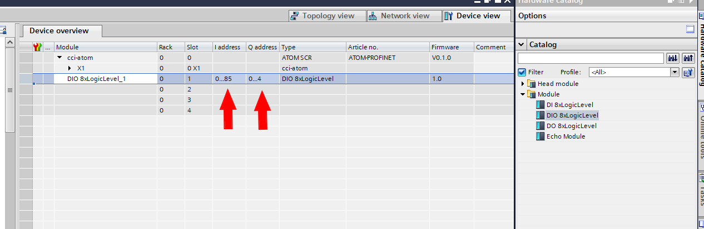
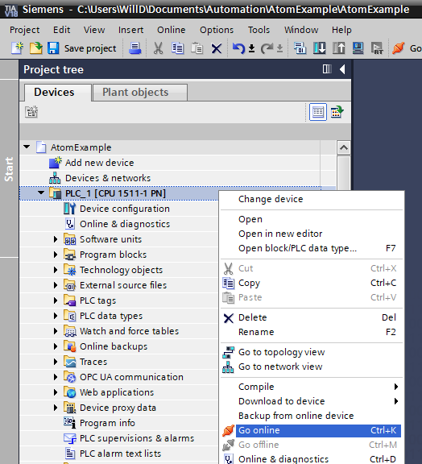
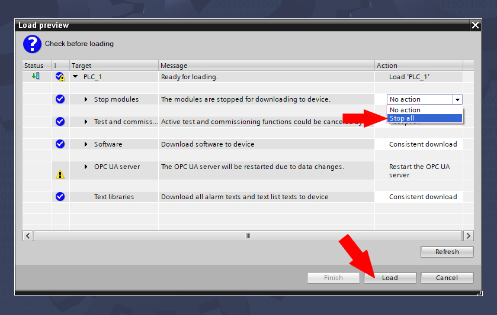
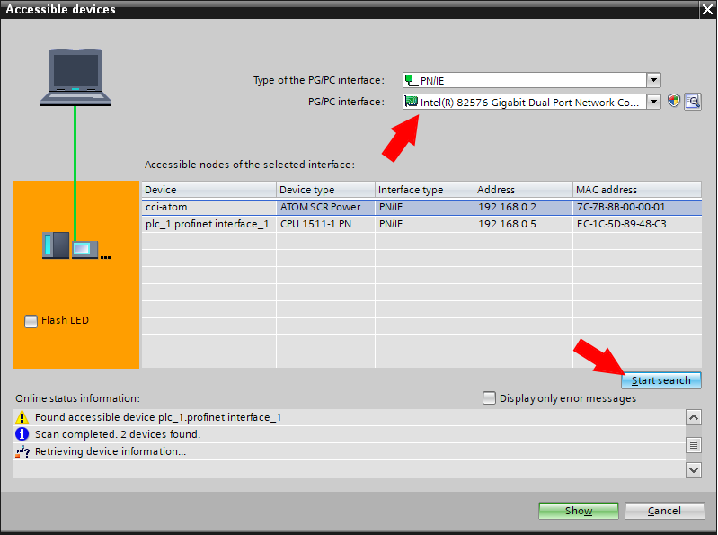

import PLC from './assets/tia/add-plc-2.png';

# TIA Portal V18

In this tutorial, you'll learn how to connect Atom to a Siemens PLC over Profinet. You'll learn how to update the run/stop and setpoint parameters, and monitor the heatsink temperature.

If you haven't yet, please review ATOM's [Profinet Profile](./overview).

If you'd like to skip the tutorial, you can download a completed example project in TIA Portal V18:
- Download [AtomExample.zip](./assets/tia/AtomExample.zip)

## Requirements
1. TIA Portal V18
2. A Siemens PLC (optional, you can still follow along by simulating the PLC on your PC).
   1.  We use a `S7-1511-1 6ES7 511-1AK02-0BA0` in this example.
   2.  You can easily follow along with a different PLC if you have a different one.
3. Download Atom's [GSDML file](./assets/ATOM-GSDML-20231108.zip)

## Hardware setup
:::info
If you're using the PLC simulator, skip to the [next section](#creating-a-project-in-tia-portal-v18).
:::

:::warning Important
When Atom is configured for Profinet, the Ethernet port closest to the 24V power connector is **disabled**.
:::

Connect 24V to your PLC and Atom unit with the provided power cable. Connect two Ethernet cables to the PLC:
- P1: Connect to your PC
- P2: Connect to your Atom unit

:::info
To simplify this diagram, we have not connected a load to Atom.

If you do not connect a load, you can still verify your PLC is working by connecting a USB
cable to Atom and using Control Panel to watch the parameters change/verify the PLC is receiving the correct monitor data.
:::

## Creating a project in TIA Portal V18

Open TIA Portal V18. If you're in the _Portal view_ (shown below), switch to _Project view_ by clicking in the lower left:

Next, select **Project** > **New**:

Give your project a name, like `AtomExample`, then click **Create**:

## Importing Atom's GSDML file into TIA

A GSDML file describes the capabilities of a Profinet device &mdash; the parameters, communication modes, diagnostics (and more) that the device supports. We'll
import Atom's GSDML file into TIA so that TIA knows how to talk to Atom.

Select **Options** > **Manage general station description files**:

Enter the path of the folder containing your GSDML file, check `GSDML-V2.43-Control-Concepts-ATOM-20231108.xml`, then click **Install**:

If everything goes well, a dialog should appear "Installation was completed successfully". Click **Close**.

## Adding and configuring your PLC
:::info
Even if you're using the PLC simulator, still follow this section and add a Siemens PLC to your project. TIA is capable of simulating the S7-1500 series PLCs.
:::

In the **Project tree** pane, within the **Devices** tab, double click **Add new device**:

Select the **Controllers** tab, and browse to **Controllers** > **SIMATIC S7-1500** > **CPU** > **CPU 1511-1 PN** > **6ES7 511-1AK02-0AB0** (if you're using a different PLC, select that PLC instead):

:::info
You can generally find your PLC's model number on the frame of your PLC. You can also check the firmware version (and model number) within the **Overview** page on your PLC:

:::

Then, click **Ok**:

A **PLC security settings** dialog will popup. For this example, we'll disable the PLC password (unchecked):

Leave **Only allow secure PG/PC and HMI communications** checked, then click **Next>>**:

For this example, change **Access level without password** to **Full access (no protection)**, then click **Next>>**:

Then, click **Finish**:

The PLC should appear in the **Network view**:

## Adding and configuring Atom

To add Atom to your project, select the **Hardware catalog** tab on the right side of the screen. Enter `ATOM` in the search box and double click **ATOM SCR**:

Atom should appear in the **Network view** of your project:

Click **Not assigned** on the Atom block, and select **PLC_1.PROFINET interface_1**:

After doing so, a network connection should appear between the PLC and Atom:

Next, double click on the Atom block to open its **Device view**:

Select the **Hardware catalog** tab on the right side, expand **Module** and select drag the **DIO 8xLogicLevel** module into **Slot 1** of Atom:

Your Atom module configuration should look like this:

:::info
The two red arrows indicate the number of input and output parameters that Atom supports. In this case, the addresses `IW0` to `IW85` are input parameters and `QW0` to `QW85` are output parameters.
Check out the [Profinet Profile](./overview) for more information on the available parameters.
:::

## Network provisioning
Let's set up a basic Profinet network. We'll provision a basic network like so:
- PC
  - IP address `192.168.0.25`
  - Subnet mask `255.255.255.0`
  - Only used for loading the PLC program
- Siemens PLC
  - Station name `plc-1`
  - IP address `192.168.0.1`
  - Subnet mask `255.255.255.0`
  - Port P1 connected to PC
  - Port P2 connected to Atom
- Atom
  - Station name `atom-1`
  - IP address `192.168.0.2`
  - Subnet mask `255.255.255.0`

Return to the **Network view**, right click the PLC block (make sure to right click directly on the graphic) and select **Properties**:

Navigate to **PROFINET interface [X1]** and select **Ethernet addresses**. Change these to match our network provisioning above:

Navigate back to the **Network view**, right click the Atom block (make sure to right click directly on the graphic) and select **Properties**:

Navigate to **PROFINET interface [X1]** and select **Ethernet addresses**. Check these to match our network provisioning above:

## A basic test
Now that we've configured our network, we should be able to run a simple test to make sure everything is working.

### Download to your PLC
Right click on **PLC_1** in the device tree and select **Download to device** > **Software (all)**:

The **Extended download to device dialog** will appear.

:::info
- The green box shows your provisioned network settings, in other words, what you _want_ them to be.
- The red box shows the actual (current) network settings &mdash; the actual IP addresses of the PLC, Atom, etc.
- The blue box lets you configure the Ethernet interface on your PC and Profinet subnet to search for your PLC on.

Your PLC will automatically update the station names, IP addresses, and subnet masks that you set up in [network provisioning](#network-provisioning)
when you start your PLC program, so you don't need to change them manually. The reason this dialog shows up is so that you can tell TIA which PLC to load the program on to.

Make sure **Show compatible devices** is selected, click **Start search**, wait for your PLC to appear, select it, then click **Load**.
Notice that our PLC's actual IP address (`192.168.0.5`) isn't the same as the IP address we provisioned for it (`192.168.0.1`). This is fine,
because we've linked our provisioned PLC to an actual PLC on the network, TIA knows whichs PLC to program and subsequently will update its network settings along
with the network settings of all other Profinet devices on your provisioned network.
:::

You may get a warning dialog like "**X.X.X.X** might not be a trustworthy device", click **Connect**:

The **Load preview** dialog will open, when it finishes preparing, click **Load**.

:::info
If the load fails, see [Troubleshooting](#troubleshooting).
:::

### Use a simulator
If you don't have a real PLC handy, you can instead start the PLC simulator by right clicking **PLC_1** in the devices tree and selecting **Start simulation**:

### Monitor the heatsink temperature

Next, right click **PLC_1** in the device tree and select **Go online**:

If everything goes well, your device tree should display green checkmarks over each device and their associated modules:

Open the case of your PLC and put it into **RUN** mode (or, if you're using the simulator, click **RUN** in the PLC simulator popup):

Next, expand **Watch and force tables** under **PLC_1** in the device tree and double click **Add new watch table**:

Double click the newly created watch table **Watch table_1** to open it:

On the first row, enter `%IW15`, then right click the row and select **Monitor all**. `%IW15` is short for
input word #15, which corresponds to the low-order word of the heatsink temperature parameter. After clicking **Monitor all**,
you should see the value update to a non-zero value. If it does, this means your PLC is successfully talking to Atom over Profinet!

## Building a simple PLC program to control Atom

### Writing some ladder logic

In the devices tree, expand **PLC_1** > **PLC tags** and double click **Show all tags**. Create two tags:
- Tag #1
  - Name: `Run/Stop`
  - Data type: `Bool`
  - Address: `%Q4.0`
- Tag #2
  - Name: `Setpoint`
  - Data type: `Dint`
  - Address: `%QD0`

Next, in the device tree, expand **PLC_1** > **Program blocks** and double click **Main [OB1]**.

First, create two constants:
- Name: `Run stop enabled`, Data type: `Bool`, Default value: `true`
- Name: `Setpoint`, Data type: `Dint`, Default value: `5000`

These are the values we will ultimately set to Atom.

Next, create two networks.

- Network #1
  - Insert a **contact** on the left, and drag the `Run stop enabled` constant into it.
  - Insert an **assignment** on the right, and enter `%Q4.0`
- Network #2
  - Insert a **MOVE** block
    - Insert a **contact** on the **EN** input, and set its value to `true`
    - Drag the `Setpoint` constant into the **IN** input
    - Enter `%QD0` into the **OUT1** output

After you're done, your PLC program should look like this (you can also download the [example project](./assets/tia/AtomExample.zip) with the completed program):

### Running on your PLC
:::info
This will still work if you're running a simulator, make sure you started the simulation as shown in [Use a simulator](#use-a-simulator).
:::

Right click **PLC_1** in the devices tree, select **Download to device** > **Software (all)**:

A **Load preview** dialog will show up, if your PLC was previously running, you may have to set the **Stop modules** action to **Stop all**. Then, click **Load**:

If the load fails, check out [Troubleshooting](#troubleshooting). Otherwise, click **Finish**:

Make sure your PLC is set to RUN. If everything worked, the PLC will put Atom into RUN with a setpoint of `5000`.
If you connect a USB cable to your Atom and look in Control Panel, you should see the setpoint and run/stop parameters update.

:::info
Try switching the **Stop / Run** switch _off_ in Control Panel or updating the setpoint. Notice that the PLC immediately sets the run/stop and setpoint parameters back to their original values.
:::

## Troubleshooting

### Download to PLC fails
If the download to your PLC fails, you can try resetting your PLC. 

First, click the **Accessible devices** icon in the menu bar:

When the **Accessible devices** dialog appears, select the network adapter on your PC that is connected to your PLC and click **Start search**:

In the devices tree, expand **Online access** > Your PC's network adapter connected to your PLC > **plc_1.profinet interface_1 (192.168.0.05)** (may be different for you) > **Online & diagnostics**:

Expand **Functions** > **Reset to factory settings**, check **Format memory card**, then click **Reset PLC**:

