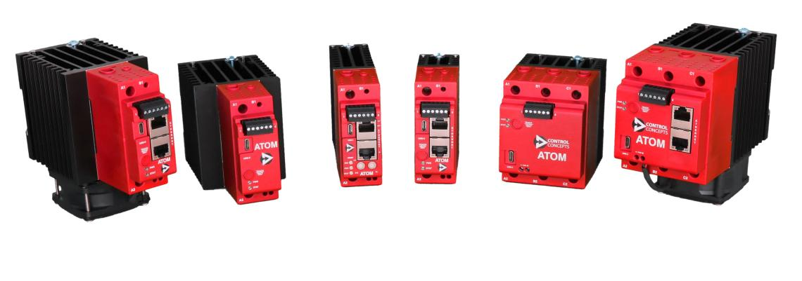

# Overview

ATOM is an ultra-compact low cost microprocessor-based power controller to assist with control of AC loads.

The following ATOM models are available for purchase:
- Single phase (`1PH`)
  - Analog, `25-80A`
  - Digital (ModbusTCP, EtherNet/IP, or Profinet), `25-80A`
  - EtherCAT, `25-80A`
- Three phase (`3PH`)
  - Analog, `16-80A`
  - Digital (ModbusTCP, EtherNet/IP, or Profinet), `16-80A`

:::info
Scan the QR code on your ATOM product label or use [this utility](https://ccipower.com) to list the features available on your ATOM.
:::

:::info
For ordering information, please visit [our website](https://ccipower.com).
:::

## Power requirements
ATOM can be powered in two ways:
- USB connection - Limited functionality for quick configuration with Control Panel
- 24 VDC power supply - Required for full operation, fieldbus communication and load control