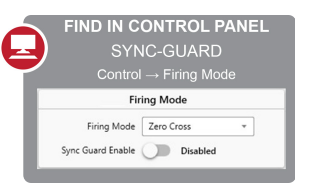

# SYNC-GUARD

SYNC-GUARDTM is useful whenever there are two or more power controllers connected to the same power source with
zero-cross firing mode selected. SYNC-GUARD can significantly reduce the peak current required from a source that is
supplying AC power to multiple power controllers while all are zero-cross firing.

Without SYNC-GUARDTM, multiple zero cross controllers could potentially be ON and
OFF at the same time. This would require much greater current drawn from the
source while the controllers are ON, and no current when they are OFF. The SYNCGUARD feature works to reduce peak current draw required from the source by
allowing each controller to attempt to find a time to turn ON when fewer, or no other,
controllers are firing.

When enabled, SYNC-GUARDTM reduces the possibility of synchronous firing of two
or more controllers. This feature does not alter the power applied to the load, but
adjusts the time when power is applied in such a manner as to reduce the chance
of multiple controllers simultaneously being ON or OFF.

Limitations:
- SYNC-GUARDTM works to reduce the peak current draw from a source powering
multiple controllers. Each controller cannot predict when another controller is going
to fire. The probability of multiple controllers firing at the same time still exists when
- SYNC-GUARDTM is enabled. This most commonly occurs if many controllers transition
to the RUN state and begin outputing at the same time.
- SYNC-GUARDTM is compatible with up to 10 controllers on the same network.
  
## Enabling SYNC-GUARD
Sets the state of the SYNC-GUARDTM feature.
When a compatible zero-cross firing mode is selected, this parameter
is able to be enabled/disabled through fieldbus communications or
within Control Panel under the Firing Mode selections

