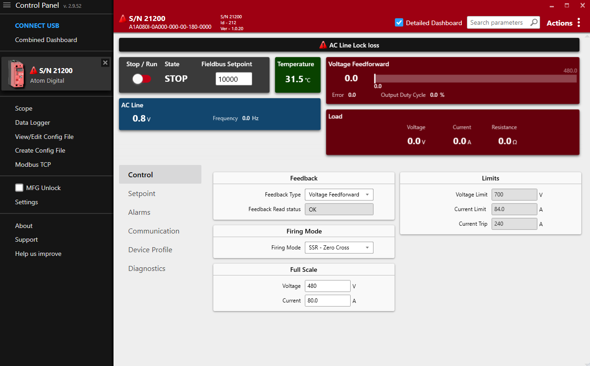

# Overview

Control Panel is a free Windows application that allows you to connect to and configure our products over USB or Ethernet. It provides a user-friendly interface to configure parameters, monitor data, and perform diagnostics.

:::info
[Download Control Panel](https://ccipower.com/products/accessories/control-panel-software)
:::

